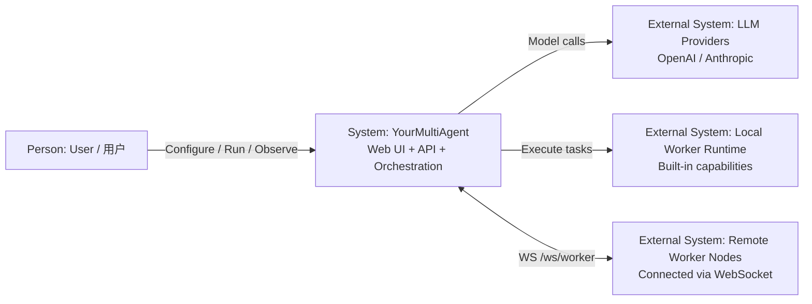

# YourMultiAgent

个人多 Agent 平台：支持在页面中配置多个 Agent、编排交互模式，并让 Worker 以**本机内置**或**远程接入**两种方式执行任务。

## 项目定位

YourMultiAgent 面向“个人可控、多 Agent 协作”的开发与实验场景，当前目标是：

- 在一个 Workspace 中管理 Agent 与 Worker。
- 通过 Web 页面完成配置、运行与结果观察。
- 用会话历史（summary + memory）在长对话下保持上下文连续性。

## 核心能力

- **多 Agent 协作执行**：支持按 Workspace 组织运行链路。
- **双 Worker 模式**：
  - Local Worker（服务内置，开箱即用）
  - Remote Worker（通过 WebSocket 挂载远端能力）
- **会话历史管理**：支持多会话、自动 compact、结构化 memory 提取。
- **前后端一体运行**：后端 API + WebSocket，前端 React 控制台。

## 技术栈

| 层 | 技术 |
|----|------|
| 后端 | Python 3.12, FastAPI |
| 前端 | React 19, Vite, Ant Design |
| LLM | OpenAI / Anthropic（按页面配置） |
| 持久化 | Workspace JSON（当前），后续可扩展 |
| Worker 通信 | Local Worker + WebSocket Remote Worker |

## 仓库结构

```text
YourMultiAgent/
├── .agents/skills/          # Codex / 通用 Agent 技能
├── .claude/skills/          # Claude 技能
├── docs/                    # 项目文档
├── server/                  # FastAPI 后端（COLA 分层）
│   ├── adapter/
│   ├── app/
│   ├── domain/
│   ├── infra/
│   └── tests/
├── web/                     # React 前端（构建输出到 server/web/）
└── worker_client/           # npm 浏览器 Worker 客户端（Playwright）
```

## 快速开始 / Quick Start

### 中文

推荐直接使用一键部署脚本。首次安装和后续增量更新都优先走这个入口：

```bash
curl -O https://raw.githubusercontent.com/coolerwu/YourMultiAgent/main/run.sh
chmod +x run.sh
./run.sh prod 10000
```

该命令会自动：

- 优先通过 `https://github.com/coolerwu/YourMultiAgent.git` clone / pull 代码
- 如果服务器没有 `git`，自动回退到下载 GitHub 源码包并解压
- 创建或复用 `~/.yourmultiagent` 作为生产数据目录
- 创建 `.venv` 并安装运行时依赖
- 注册或更新 `systemd` 服务 `yourmultiagent`，并确保服务已启用开机自启
- 启动或重启服务，并验证 `/api/health`

前提：

- 服务器已具备 `python3`、`python3-venv`、`sudo`、`systemctl`
- 若服务器没有 `git`，还需要具备 `curl` 和 `tar`
- 前端构建产物 `server/web/` 已进入 Git 仓库，否则远端拉代码后不会拿到最新页面
- 生产数据必须放在 `~/.yourmultiagent`，不要放进项目目录下的 `data/`

### English

Use the one-command deployment script for both first-time setup and incremental updates:

```bash
curl -O https://raw.githubusercontent.com/coolerwu/YourMultiAgent/main/run.sh
chmod +x run.sh
./run.sh prod 10000
```

What this command does:

- Clones/pulls code from `https://github.com/coolerwu/YourMultiAgent.git` when `git` is available
- Falls back to downloading and extracting the GitHub source archive when `git` is unavailable
- Creates or reuses `~/.yourmultiagent` as the production data directory
- Creates `.venv` and installs runtime dependencies
- Registers or updates the `yourmultiagent` `systemd` service and ensures it is enabled on boot
- Starts/restarts the service and verifies `/api/health`

Prerequisites:

- `python3`, `python3-venv`, `sudo`, and `systemctl` are available on the server
- If `git` is unavailable, `curl` and `tar` are also required
- Front-end build output (`server/web/`) must be committed to the repository for remote deployments
- Production data should stay in `~/.yourmultiagent` (do not store production data under project `data/`)

## C4 Level 1（System Context）/ C4 一级图（系统上下文）



- **中文**：用户通过 Web UI 管理 Workspace、配置 Agent 并发起运行；YourMultiAgent 统一编排执行，并调用外部 LLM 与本地/远程 Worker 完成任务。
- **English**: Users manage workspaces, configure agents, and run tasks via the Web UI; YourMultiAgent orchestrates execution and integrates with external LLM providers plus local/remote workers.

## 本地开发

### 环境准备

- Python `>=3.12`
- Node.js `>=18`

### 安装依赖

```bash
# 后端（项目根目录）
pip install -e .

# 前端
cd web && npm install
```

说明：

- 后端默认会安装 `httpx[socks]`，以支持通过 SOCKS 代理访问外部服务
- 如果当前虚拟环境是旧版本依赖升级上来的，执行一次 `pip install -e .` 即可补装 `socksio`

### 启动服务

#### 方式 A：直接启动后端（开发常用）

```bash
cd server && python main.py
```

服务默认监听：`http://localhost:8080`

#### 方式 C：使用 CLI（推荐统一入口）

```bash
# 开发模式（DATA_DIR=./data）
yourmultiagent start --dev --reload

# 生产模式默认 DATA_DIR=~/.yourmultiagent
yourmultiagent start --port 8080
```

#### 启动前端开发服务

```bash
cd web && npm run dev
```

默认地址：`http://localhost:5173`

## Remote Worker 接入

启动一个远程 Worker 并连接 Central Server：

```bash
yourmultiagent worker --server ws://localhost:8080 --name my-worker
```

后端会通过 `/ws/worker` 接收并管理远程 Worker 注册。

### Browser Worker Client

仓库内置了一个可单独作为 npm 包运行的浏览器 Worker：

```bash
cd worker_client
npm install
npx playwright install chromium
npx yourmultiagent-browser-worker --server ws://localhost:8080 --name browser-worker-1
```

它会注册 `browser_*` 能力，并可在 Worker 管理页中按模板授权。
支持通过 `--allow-origin`、`--max-sessions`、`--max-screenshot-kb`、`--max-text-chars`、`--max-html-chars` 添加基础安全限制。

## API 与 WS 入口（后端）

- `GET /api/health`：健康检查
- `POST /api/agents/*`：Agent 相关接口
- `POST /api/workspaces/*`：Workspace 相关接口
- `POST /api/workers/*`：Worker 管理接口
- `WS /ws/workspaces/{id}/run`：运行流式通道
- `WS /ws/worker`：Remote Worker 接入通道

> 实际路由以 `server/adapter/` 中控制器定义为准。

## 会话历史与上下文机制

当前会话能力要点：

- 每条会话通过 `session_id` 续聊
- 消息超过阈值自动 compact
- compact 输出固定结构摘要（目标 / 已完成 / 约束 / 文件 / 待继续）
- 每轮自动提取结构化 memory（goal/constraint/decision/artifact）

详细说明见：[`docs/session-history.md`](docs/session-history.md)

## 测试与构建

```bash
# 后端测试
pytest server/tests/ -v

# 前端测试
cd web && npx vitest run

# 前端构建（输出到 server/web/）
cd web && npm run build
```

## 开发约定（摘要）

- 后端遵守 COLA：`adapter -> app -> domain <- infra`
- 尽量做最小化改动，避免越层耦合
- 新功能优先保证可运行、可验证
- 需要补充文档时，优先放到 `docs/*.md`，README 保持入口与总览

## 相关文档

- [`Agents.md`](Agents.md)：项目总体约定与协作规范
- [`CLAUDE.md`](CLAUDE.md)：Claude 代理协作说明
- [`docs/session-history.md`](docs/session-history.md)：会话历史 / compact / memory 机制
- [`docs/operations.md`](docs/operations.md)：系统设置、Update Now 与 Codex 运行时说明

## 系统设置与 Codex 运行时

左侧 `系统设置` 页面当前包含：

- `Update Now`
  - 对当前应用执行增量更新并重启服务
- `Codex 运行时`
  - 查看当前宿主机上的 Codex CLI 版本、安装路径、登录状态
  - 执行 `检测环境`、`安装/更新 Codex`、`登录 Codex`
- `全局模型连接`
  - `API Providers` 现在只有共享列表，没有默认 Provider
  - 每个列表项维护 `名称 / Provider 类型 / 模型 / URL / API Key`
  - 所有 LLM 角色都必须显式绑定其中一个 API Provider
- `应用日志`
  - 直接查看当前宿主机唯一的 `app.log`
  - 统一记录 HTTP、WebSocket、Worker、Store、AI、系统设置与 `uvicorn` 访问事件
  - `app.log` 仅保留最近 3 天日志

需要注意：

- `Codex 运行时` 是宿主机级能力，不是每个 Workspace 独立一套
- 当前同一台宿主机只支持一份 Codex CLI 安装和一份有效登录态
- 如果系统设置里有多个 Codex 连接，它们当前主要是“配置引用”而不是“多账号隔离”

编排与图编辑中的模型配置弹窗也已统一为先选 `模型类型`：

- 选择 `LLM` 时显示共享 `API Provider` 绑定，不再使用全局默认 Provider
- 选择 `Codex` 时只显示 Codex 登录连接和 Codex 模型字段

安装或更新 Codex 完成后，建议：

```bash
codex login --device-auth
```

如果当前终端里还找不到新安装的命令，请先退出终端并重新进入。
