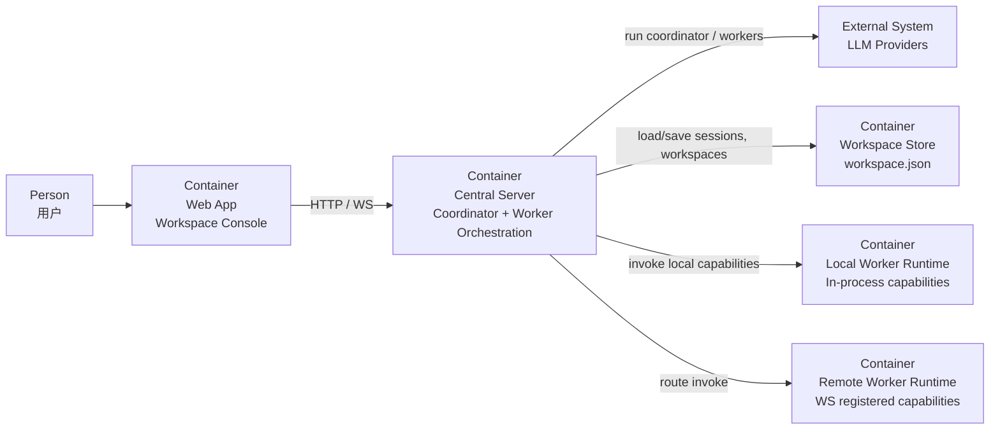

# Agent Model

本文档使用 C4 Model Level 2（Container Diagram）描述多 Agent 运行模型在系统容器层面的关系，而不是类图或组件图。

## 目标

- 说明主控、Worker、Worker Runtime、会话存储之间的容器关系
- 说明“大脑”和“执行能力”在当前系统中的边界
- 作为后续扩展多 Worker / 专用 Worker 时的模型基线

## C4 Level 2

## 容器角色

- `Central Server`
  - 当前“大脑”所在容器
  - 包含主控执行器、Worker 顺序调度、会话历史注入、工具路由和运行事件流
- `LLM Providers`
  - 为主控和 Worker 提供推理
  - 不负责持久化会话和执行工具
- `Workspace Store`
  - 保存 Workspace、会话、summary、memory
- `Local Worker Runtime`
  - 提供进程内 capability
- `Remote Worker Runtime`
  - 提供通过 WebSocket 注册的外部 capability
- `Web App`
  - 配置 Agent、查看运行态、展示 Worker 状态

## 当前大脑模型

- 当前大脑位于 `Central Server`
- 主控先生成拆解计划，再按顺序执行 Worker
- Agent 实际上下文由以下内容拼接
  1. `system_prompt`
  2. 自动注入的工具使用约束
  3. 会话 summary
  4. memory_items
  5. 最近消息窗口
  6. 当前用户消息
- 大脑当前不直接持有执行能力，只通过 WorkerGateway 调用能力

## 当前边界

- 编排仍是单主控、顺序 Worker，不是 DAG 调度
- Worker 协作主要依赖自然语言 assignment 和 `shared/` 交接约定
- 浏览器、代码执行等专用能力优先通过 Worker 扩展，而不是直接塞进大脑

## 对应代码位置

- 主控与执行器
  - `server/domain/agent/service/orchestrator.py`
  - `server/domain/agent/service/workspace_executor.py`
- 单节点工具循环
  - `server/domain/agent/service/react_loop.py`
- 会话历史
  - `server/domain/agent/service/session_history.py`
- Worker 抽象与路由
  - `server/domain/worker/gateway/worker_gateway.py`
  - `server/infra/worker/worker_router.py`
