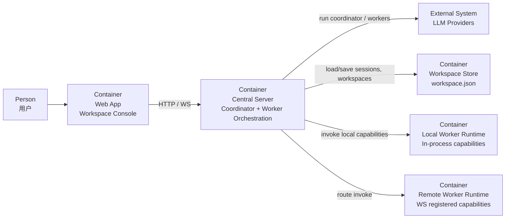

# Agent Model

本文档使用 C4 Model Level 2（Container Diagram）描述多 Agent 运行模型在系统容器层面的关系，而不是类图或组件图。

## 目标

- 说明主控、Worker、Worker Runtime、会话存储之间的容器关系
- 说明“大脑”和“执行能力”在当前系统中的边界
- 作为后续扩展多 Worker / 专用 Worker 时的模型基线

## C4 Level 2

## 容器角色

- `Central Server`
  - 当前“大脑”所在容器
  - 包含 Coordinator 计划生成、Task DAG 校验与调度、会话历史注入、工具路由和运行事件流
- `LLM Providers`
  - 为主控和 Worker 提供推理
  - 不负责持久化会话和执行工具
- `Workspace Store`
  - 保存 Workspace、会话、Run、Task、Artifact、summary、memory
- `Local Worker Runtime`
  - 提供进程内 capability
- `Remote Worker Runtime`
  - 提供通过 WebSocket 注册的外部 capability
- `Web App`
  - 配置 Agent、查看运行态、展示 Worker 状态

## 当前大脑模型

- 当前大脑位于 `Central Server`
- 主控先生成结构化任务计划，后端将计划解析为 Task DAG，再按依赖调度 Worker
- 每次用户执行会创建一个 `Run`，Run 下包含任务列表、任务状态、Worker 输出和 Artifact 引用
- 若 Coordinator 没有返回标准 JSON，后端会将现有 Worker 顺序退化为线性 DAG，以兼容旧 Workspace
- Workspace 模式下，主控可配置 `git_workflow`。该配置会随 `workspace.json` 持久化，当前用于记录仓库地址、基础分支、分支/提交/PR 模板和人工 Review 要求；仓库地址可通过后端 Git 验证端点检查本地路径或远程分支可访问性
- Agent 实际上下文由以下内容拼接
  1. `system_prompt`
  2. 自动注入的工具使用约束
  3. 会话 summary
  4. memory_items
  5. 最近消息窗口
  6. 当前用户消息
- 大脑当前不直接持有执行能力，只通过 WorkerGateway 调用能力

## 当前边界

- 编排是单 Coordinator + Task DAG 调度，第一阶段同一 ready 层仍保守顺序执行，后续可扩展并发
- Worker 协作依赖结构化 Task、上游结果摘要和 `shared/` 交接约定
- 浏览器、代码执行等专用能力优先通过 Worker 扩展，而不是直接塞进大脑

## 对应代码位置

- 主控与执行器
  - `server/app/agent/orchestrator.py`
  - `server/app/agent/workspace_executor.py`
  - `server/app/agent/task_planner.py`
  - `server/app/agent/task_scheduler.py`
  - `server/app/agent/task_context_builder.py`
- Run / Task / Artifact 领域模型
  - `server/domain/agent/run_entity.py`
- 单节点 Agent 运行时
  - `server/domain/agent/agent_runtime.py`
  - `AgentRuntime` 是单个 Agent 配置的一次上下文对话运行循环，不是可独立调度、可持久控制的 Agent 本体
- 会话历史
  - `server/domain/agent/session_history.py`
- Worker 抽象与路由
  - `server/domain/worker/worker_gateway.py`
  - `server/infra/worker/worker_router.py`
