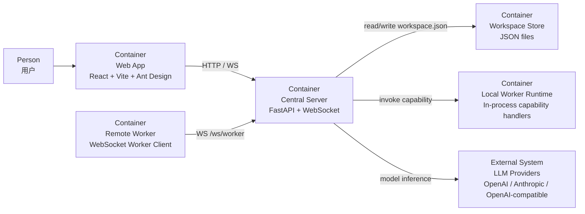

# Server Architecture

本文档使用 C4 Model Level 2（Container Diagram）描述 `server/` 的后端容器级结构。

## 目标

- 说明后端在整个系统中的职责边界
- 说明后端内部主要容器与外部系统的关系
- 为后续细化 adapter / app / domain / infra 提供统一入口

## C4 Level 2

## 容器说明

- `Web App`
  - 提供 Workspace 配置、运行、Worker 管理和会话查看界面
  - 通过 HTTP API 和 WebSocket 与 Central Server 通信
- `Central Server`
  - 系统核心容器
  - 负责 Workspace 编排、会话历史、Prompt 注入、工具路由、远程 Worker 接入和前端静态资源托管
- `Workspace Store`
  - 当前持久化容器
  - 使用 `setting.json` 与各 Workspace 的 `workspace.json` 保存配置、会话和编排数据
- `Local Worker Runtime`
  - Server 进程内能力执行容器
  - 提供文件、命令、HTTP 等 capability
- `Remote Worker`
  - 通过 WebSocket 注册 capability 的外部执行容器
  - 当前支持通用 Remote Worker，后续可扩展浏览器 Worker 等专用执行端
- `LLM Providers`
  - 外部模型服务
  - 为主控和 Worker 提供推理能力

## 后端边界

- 后端负责“编排、上下文、路由、治理”，不直接承担所有执行能力
- 工具执行优先通过 WorkerGateway 统一抽象，不在编排层硬编码具体能力实现
- 持久化当前限定为 JSON 文件，不引入数据库和向量检索

## 对应代码目录

- `server/adapter/`
  - HTTP / WebSocket 接入层
- `server/app/`
  - 应用服务与流程编排
- `server/domain/`
  - 核心模型与规则
- `server/infra/`
  - LLM、Store、Worker 等基础设施实现
