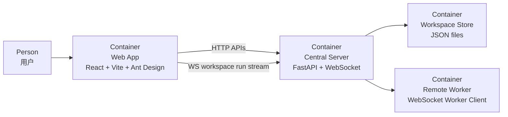

# Web Architecture

本文档使用 C4 Model Level 2（Container Diagram）描述 `web/` 前端容器在系统中的位置和交互。

## 目标

- 说明前端容器与后端、用户之间的关系
- 说明前端当前承载的主要职责
- 作为页面与状态管理演进时的统一约束入口

## C4 Level 2

## 容器说明

- `Web App`
  - 唯一前端容器
  - 承担 Workspace 列表、编排配置、运行观察、Provider 管理、Worker 授权管理等页面职责
- `Central Server`
  - 为前端提供 REST API 与运行态 WebSocket 流
  - 负责所有真正的数据读写、运行编排和 Worker 路由
- `Workspace Store`
  - 前端不直接访问
  - 所有持久化均经由 Central Server 中转
- `Remote Worker`
  - 前端不直接连接 Remote Worker
  - 只展示其状态、能力与授权配置

## 前端边界

- 前端负责展示、配置和运行观察，不持有核心业务规则
- 会话 summary / memory、Worker 注册状态、编排执行流都以后端返回为准
- 前端不直接调用 LLM，也不直接操作 Workspace JSON

## 当前前端子域

- `Dashboard`
  - Workspace 入口和主框架
- `WorkspaceOrchestrationEditor`
  - 主控与 Worker 编排配置
- `WorkspaceRunView`
  - 会话、运行流和历史上下文查看
- `WorkerStatus`
  - Worker 状态、能力列表和授权开关
- `ProviderManager`
  - LLM profile 管理

## 对应代码目录

- `web/src/pages/`
  - 页面级容器
- `web/src/components/`
  - 业务组件
- `web/src/utils/`
  - API 客户端与前端工具层
